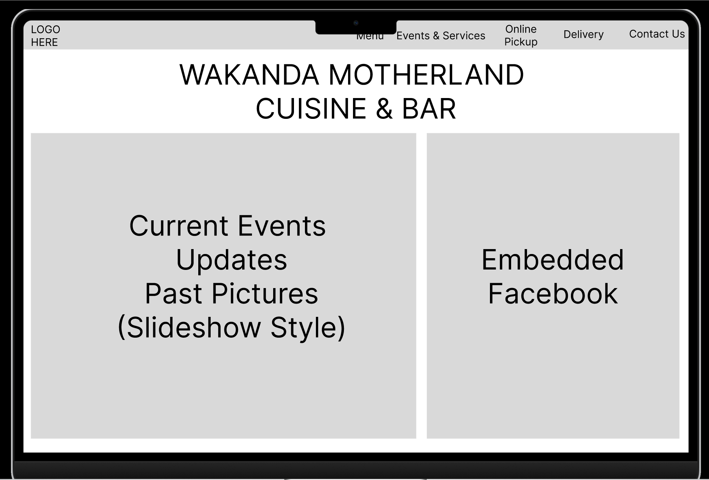
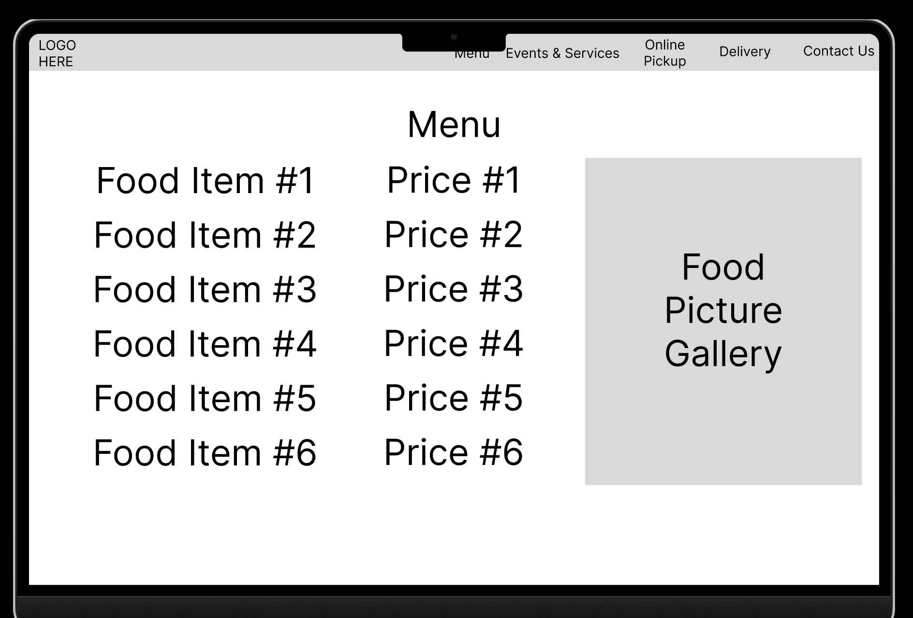
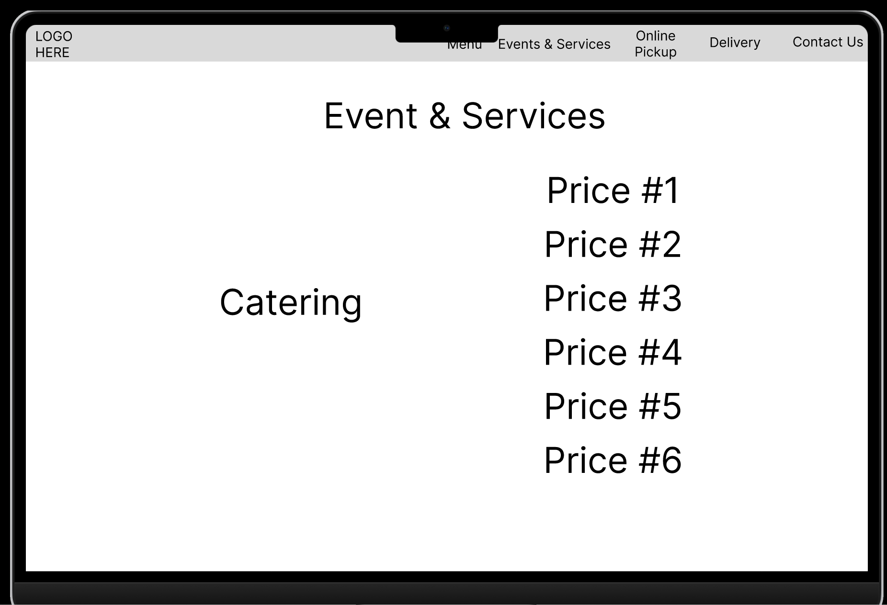
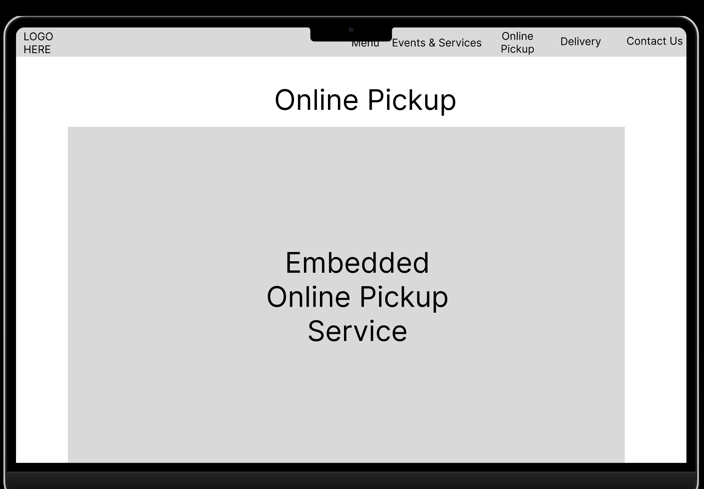
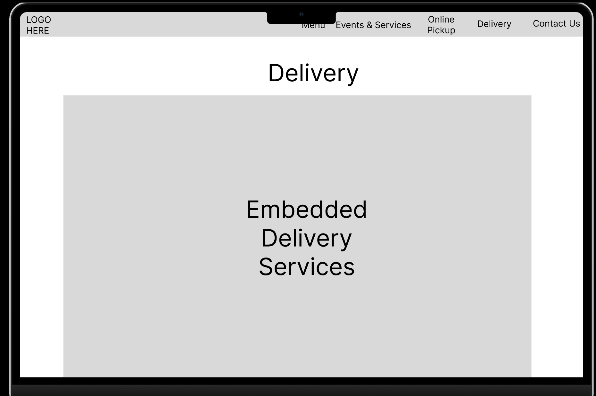
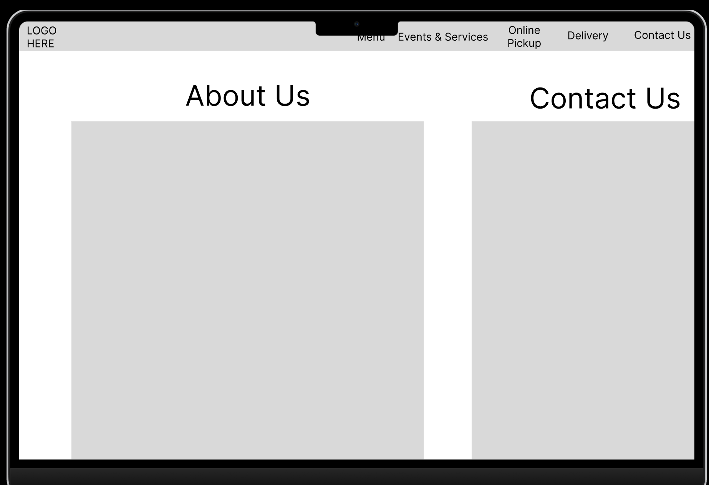

## Figma Mockup
Here we have the figma mockups after discussing with my client preliminary ideas
It is more of a rough outline with detail being provided later but ideally the website should have this basic functionality and the display services.

***

## Planning
I'm still researching for best course of action. I'm having a look at Gatsby that utilizes React.js but I still need to look into it more.

[< Back](./)
