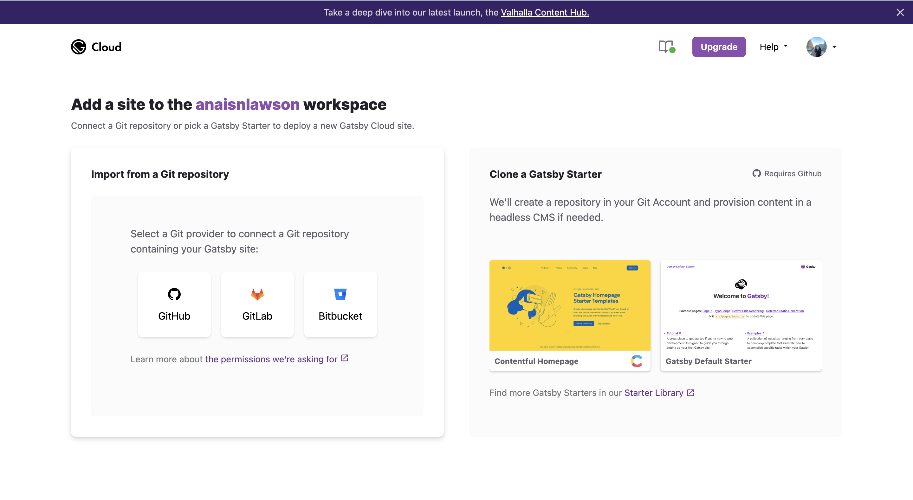

## Working with Gatsby React.js
Because I’m not familiar with Gatsby, I had to debate whether or not I should start with a more structured code base or boiler plate. I ended up leaning towards simple boiler plate because when using a more structured template, which that provides me for more to work with, debugging becomes more difficult for maintenance in the future 

[< Back](./)
